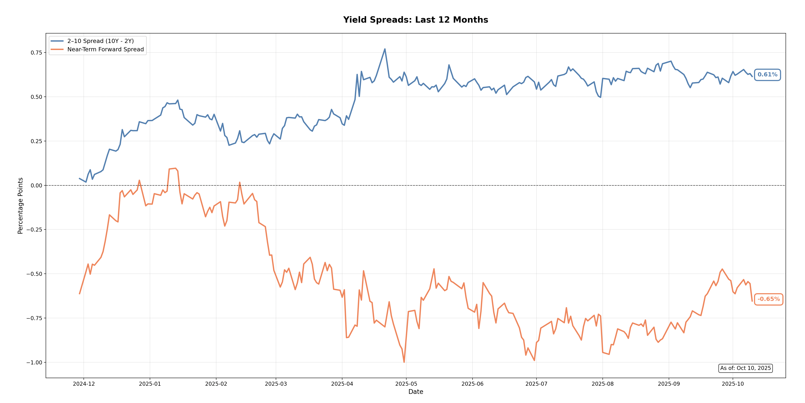

# Forward Spread Analysis

Python tool for analyzing yield curve dynamics and recession indicators using the 2-10 spread and Near-Term Forward Spread (NTFS).

## Overview

Computes and visualizes two key recession indicators:
- **2-10 Spread**: 10-year minus 2-year Treasury yields
- **Near-Term Forward Spread**: Forward-looking measure of near-term rate expectations using cubic spline interpolation



## Features

- Automated data integration from Federal Reserve H.15 and GSW datasets
- Cubic spline interpolation for forward rate extraction
- 12-month rolling visualization with current value annotations

## Methodology

**NTFS Calculation:**
```
NTFS = f(6,18) - y(3m)
where f(6,18) = 7 × y(21m) - 6 × y(18m)
```
- `f(6,18)` = 6-month forward rate starting 18 months ahead
- `y(3m)` = current 3-month T-bill rate
- Yields at 18m and 21m interpolated via cubic splines

## Installation

```bash
git clone https://github.com/benz3927/forward-spread.git
cd forward-spread
pip install pandas numpy matplotlib scipy
python forward_spread.py
```

## Usage

```python
python forward_spread.py
```

Outputs:
- Time series chart of both spreads
- Console summary of most recent values
- Negative values indicate yield curve inversion (recession signal)

## Data Sources

- **GSW Zero-Coupon Yields** (`feds200628.csv`): Fed's Gürkaynak-Sack-Wright dataset
- **3-Month T-Bill Rates** (`FRB_H15.csv`): Fed H.15 Selected Interest Rates

## Technical Stack

- **Data Processing**: pandas, numpy
- **Interpolation**: scipy.interpolate.CubicSpline
- **Visualization**: matplotlib

## Files

```
forward-spread/
├── forward_spread.py      # Main script
├── FRB_H15.csv           # 3-month T-bill data
├── feds200628.csv        # GSW zero-coupon yields
└── README.md             # This file
```

## Author

Benjamin Zhao | Hamilton College '26 | Mathematics & Economics
